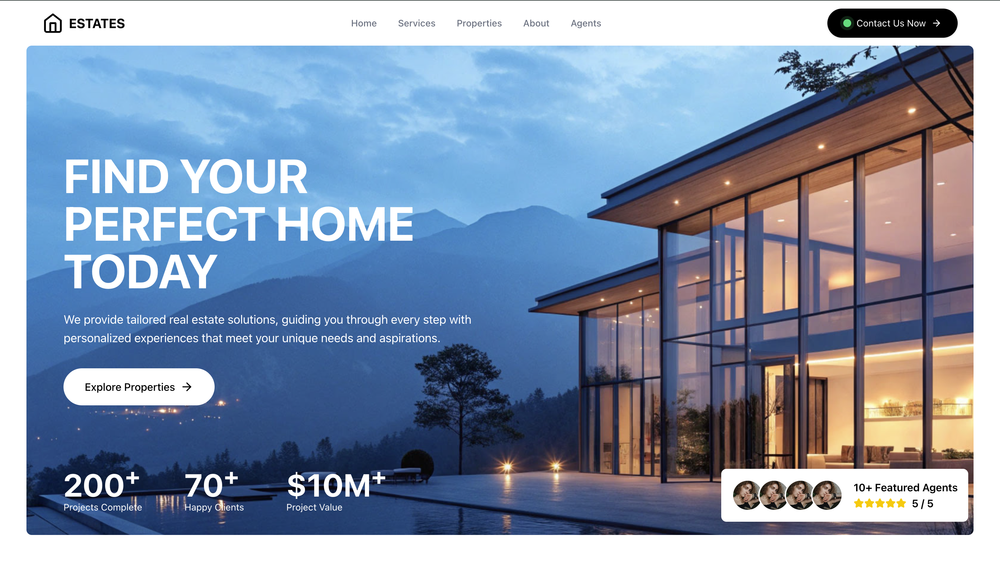
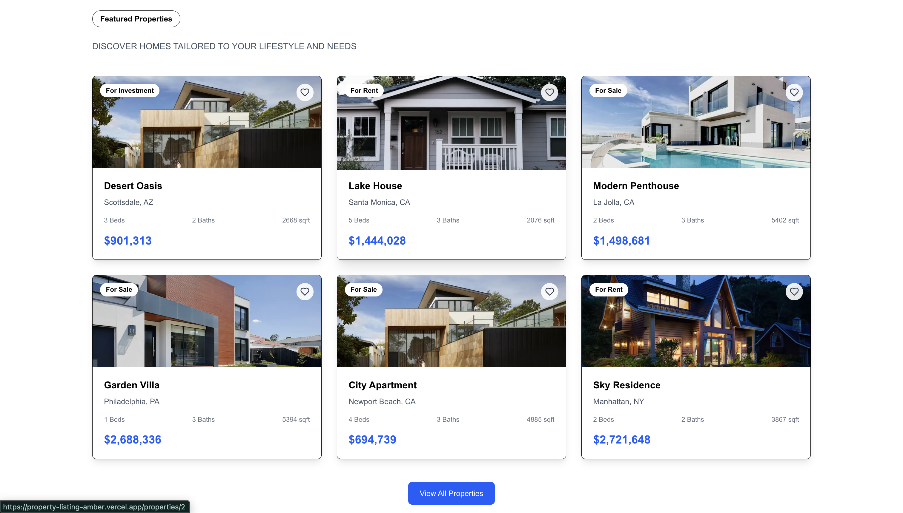

# Property Listing Platform (Full-Stack Real Estate System)

> Full-stack web application for discovering, filtering, and managing property listings with a scalable backend architecture.

---

## 🚀 Key Features

- Explore property listings through a dynamic, responsive interface  
- Filter properties based on user preferences for faster discovery  
- Secure authentication system for controlled user access  
- Efficient backend APIs for handling property data and queries  
- Smooth user experience with responsive frontend design   
- User authentication and secure access control  
- Responsive UI for smooth user experience  
- Backend APIs for efficient data handling  

---

## 🚀 Key Impact

- Enables faster property discovery compared to manual browsing  
- Handles structured property data with efficient API design  
- Simulates real-world full-stack application architecture

---

## 📸 Preview

  
  
  

---

## 🧠 Overview

This project is a full-stack property discovery platform designed to simulate real-world real estate applications.

It enables users to:
- Browse available properties  
- Filter listings based on preferences  
- Interact with a responsive and dynamic interface  

The system is built with a focus on **clean architecture, scalability, and real-world usability**, rather than just basic CRUD functionality.

---

## ⚙️ System Architecture

    Frontend (React)
            │
            ▼
    API Layer (Node.js / Express)
            │
            ▼
    Database (MongoDB)
            │
            ▼
    Authentication Layer (JWT-based)

---

## 🔍 Core Functionality

### 🖥 Frontend
- Built using React for dynamic UI  
- Component-based architecture for scalability  
- Handles user interactions and state management  

### ⚙️ Backend
- RESTful APIs using Express  
- Handles routing, business logic, and data flow  
- Structured for modular and maintainable code  

### 🗄 Database
- MongoDB for flexible data storage  
- Designed to handle structured property data  
- Enables efficient querying and filtering  

### 🔐 Authentication
- Secure user authentication system  
- Enables controlled access to features  

---

## 📊 Example Workflow

**User Action**
- User searches or filters properties  

**System Processing**
- Request sent to backend API  
- Data fetched from database  
- Results filtered and returned  

**Output**
- Filtered property listings displayed dynamically  

---

## 🛠 Tech Stack

**Frontend**
- React
- JavaScript / TypeScript
- HTML / CSS

**Backend**
- Node.js
- Express

**Database**
- MongoDB

---

## 🎯 Design Focus

- Build **scalable full-stack systems**, not just UI  
- Maintain **clean separation between frontend and backend**  
- Ensure **efficient data flow and API structure**  
- Focus on **real-world application behavior**  

---

## 📁 Project Structure

    property-listing/
    ├── client/
    ├── server/
    │   ├── routes/
    │   ├── controllers/
    │   ├── models/
    ├── package.json

---

## ⚙️ Local Setup

    git clone https://github.com/KaavyaGala546/property-listing.git
    cd property-listing

    # Install dependencies
    npm install

    # Run frontend & backend
    npm run dev

---

## 🚧 Limitations

- Basic filtering capabilities (can be expanded further)  
- No advanced search or recommendation system yet  
- UI can be extended with richer interactions  

---

## 🚀 Future Improvements

- Advanced filtering and search system  
- Saved listings / user preferences  
- Image upload and media handling  
- Map-based property visualization  
- Performance optimizations  

---

## 👨‍💻 Author

**Kaavya Gala**  
Full Stack Developer  

GitHub: https://github.com/KaavyaGala546  

---

## 💡 Final Note

This project focuses on building a **real-world full-stack system** —  
not just a frontend interface, but a complete application with backend logic, database design, and user interaction.
